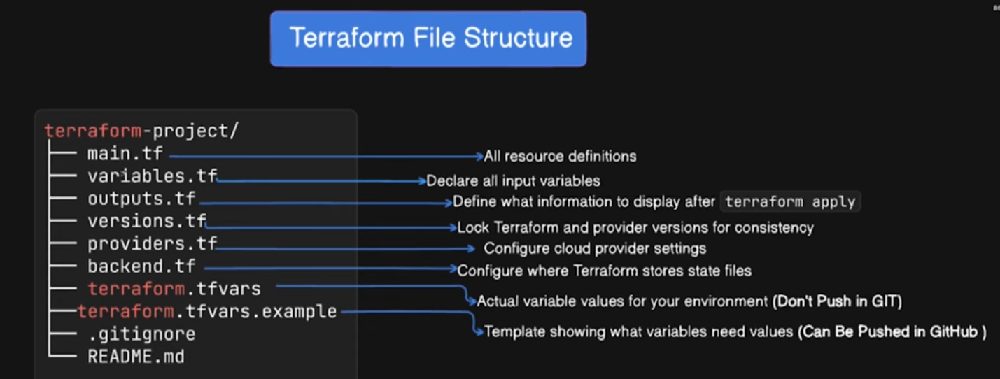

git status# Terraform File Structure.

### Best Practice
- TF folders and files organization
- 
- Specific to the environments
- Module structure. Values are kept in environment specific. (dev,qa,prod)
